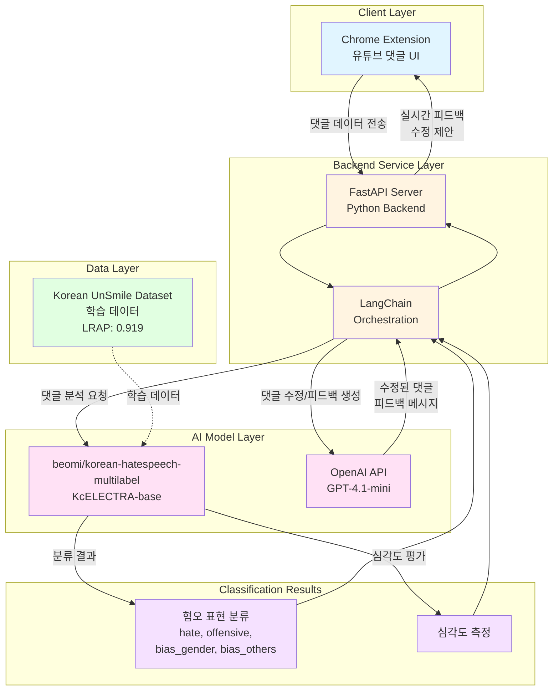
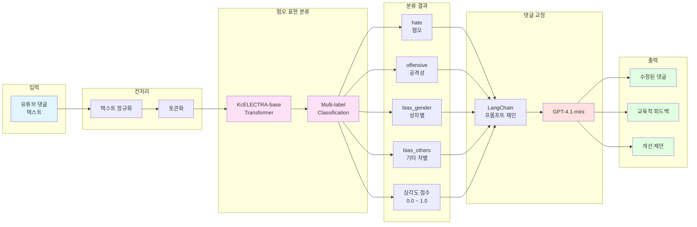

# Commento 

# 시스템 아키텍쳐


# 서비스 처리 흐름도
- 댓글 분석 프로세스 시퀀스
```
sequenceDiagram
    participant U as 사용자
    participant CE as Chrome Extension
    participant API as FastAPI Server
    participant LC as LangChain
    participant KH as korean-hatespeech<br/>모델
    participant GPT as GPT-4.1-mini

    U->>CE: 유튜브 댓글 작성/조회
    CE->>API: 댓글 텍스트 전송
    API->>LC: 분석 요청
    
    LC->>KH: 혐오 표현 검출 요청
    KH->>KH: 다중 라벨 분류<br/>(hate, offensive,<br/>bias_gender, bias_others)
    KH-->>LC: 분류 결과 + 심각도
    
    alt 문제 댓글 감지됨
        LC->>GPT: 댓글 수정 요청<br/>(원본 + 분류 결과)
        GPT->>GPT: 교정된 댓글 생성<br/>+ 피드백 작성
        GPT-->>LC: 수정 제안 + 피드백
        LC-->>API: 종합 결과 반환
        API-->>CE: 실시간 피드백 전송
        CE-->>U: 수정 제안 표시<br/>+ 교육적 피드백
    else 정상 댓글
        LC-->>API: 정상 판정
        API-->>CE: 문제없음 전송
        CE-->>U: 댓글 게시
    end
```

# 데이터 처리 파이프라인
- AI 모델 처리 과정
